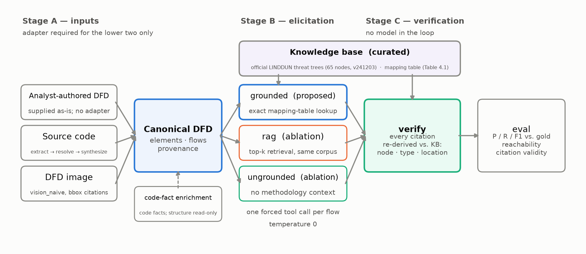
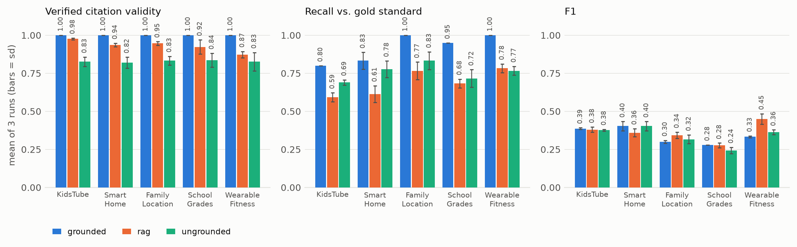
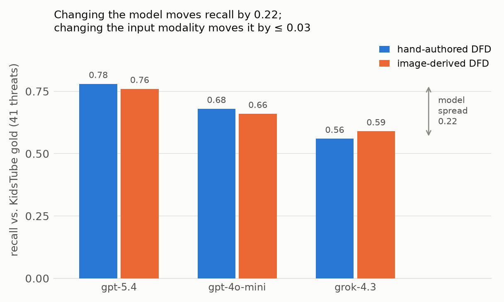

**Evaluating Privacy Threat Modelling with LLMs**

Muhammad Bilal Ali, Bakti Satria Adhityatama

# **Abstract**

LINDDUN Pro requires analysts to reason about every dataflow, process, and store in a system's Data Flow Diagram (DFD) against seven privacy threat categories. Large language models (LLMs) offer obvious leverage, and recent tools show that LLM-assisted LINDDUN elicitation is feasible, but surveys find the field still exploratory and short on standardized benchmarks. This report argues that trustworthy AI assistance in privacy engineering requires traceability that is verified rather than asserted: every generated threat cites both a LINDDUN Pro threat-tree node and a DFD location, and both citations are independently re-derived against a curated LINDDUN knowledge base after generation, so that a fabricated node or a nonexistent DFD location is detected deterministically rather than trusted from the model's own output. The central experiment is a three-way ablation isolating the grounding mechanism — deterministic mapping-table lookup, genuine retrieval (RAG), and no methodology context — replicated three times per cell across five scenarios at pinned sampling temperature (45 runs, 567 generation calls). Deterministic grounding yields **verified citation validity of 1.00 (sd 0.00) in all fifteen grounded runs: no fabricated tree node, inapplicable threat type, or nonexistent DFD location occurs in 1,546 generated threats**, against 0.87–0.98 for the RAG condition and 0.82–0.84 for the ungrounded condition. All three pairwise contrasts are statistically significant and hold in the same direction on five of five scenarios. Grounding also improves recall (+0.158 over ungrounded, p=0.011), whereas F1 does not separate the three conditions at all (grounded minus ungrounded = +0.000, p=1.00); recall and verified citation validity are therefore reported as the primary measures, and the reason F1 is uninformative for this comparison is stated explicitly. The approach is then evaluated along three further axes: (1) consistency of system output across different underlying LLMs given the same DFD; (2) the effect of the input supplied to a single model (gpt-5.4), namely a DFD alone versus a DFD combined with source code; and (3) a direct comparison against PILLAR's own output on the same gold standard. Model selection moves recall by 0.22, whereas input modality moves it by at most 0.03. In the PILLAR comparison, 82% of exported node identifiers resolve against the official threat trees and 18% contain prose or empty strings in place of identifiers, none of which are verified after generation.

# **Introduction**

Privacy engineering has become a critical discipline as modern software systems increasingly collect, process, and share sensitive personal data. Frameworks such as LINDDUN provide structured methodologies for identifying privacy risks systematically, mapping threats to specific components of a system's Data Flow Diagram across seven categories: Linking, Identifying, Non-repudiation, Detecting, Data Disclosure, Unawareness, and Non-compliance. While LINDDUN Pro is among the most rigorous and comprehensive privacy threat modeling approaches available, its thoroughness comes at significant cost: applying the full methodology requires expert knowledge of both the framework and the target system, detailed analysis of every DFD interaction, and substantial time investment.

The rapid advancement of large language models (LLMs) offers a compelling opportunity to reduce this burden. Recent tools such as PILLAR \[5\] and PriMod4AI \[6\] demonstrate that LLMs can automate meaningful parts of the LINDDUN process. However, the field remains exploratory. A 2026 survey of LLM-assisted threat modeling \[10\] found that evaluations are inconsistent, benchmarks are lacking, and a central barrier to practitioner adoption has not yet been addressed: it is difficult to tell whether an AI-suggested threat reflects sound methodology or is a plausible-sounding hallucination.

We address this gap by building and evaluating a privacy threat modeling system centered on verified traceability. Unlike prior systems that either perform no retrieval grounding (PILLAR \[5\]) or treat the model's self-reported citation as ground truth (PriMod4AI \[6\]), our approach independently re-derives every citation after generation, checking both that the cited LINDDUN threat-tree node exists in our curated knowledge base and that the cited DFD location is present in the actual system model. This post-generation verification layer means fabricated citations are caught deterministically, giving practitioners a concrete basis for auditing each suggestion.

Beyond the verification layer, this paper makes four further contributions. First, we isolate the grounding mechanism itself: a controlled three-way ablation — deterministic mapping-table lookup versus genuine retrieval versus no methodology context — run inside a single pipeline so that only the mechanism changes, replicated three times per cell across five scenarios. This answers a question the prior systems leave open, because PILLAR runs no retrieval and PriMod4AI runs retrieval without a no-retrieval or deterministic-lookup baseline. Second, we introduce source code as a first-class input modality alongside DFDs, allowing the system to discover threats arising from implementation-level decisions, such as missing deletion cascades, soft-delete patterns, or plaintext storage of sensitive fields which a DFD alone cannot surface. Third, we conduct a systematic evaluation across multiple LLMs on the same input, measuring output consistency as a proxy for reliability. Fourth, we provide a direct head-to-head comparison against PILLAR on the same gold standard and with the same matcher, giving the first quantitative benchmark of relative recall, precision, and citation resolvability between the two systems.

# **Related Work**

**Privacy Threat Modeling Frameworks.**  LINDDUN is a well-established privacy threat modeling methodology that provides a structured taxonomy of seven threat categories for analyzing software systems \[1\]. It operates in two phases: a problem space phase in which a DFD is constructed and threats are mapped to DFD elements, and a solution space phase in which identified threats are prioritized and mitigated using privacy-enhancing technologies (PETs) and privacy patterns. LINDDUN comes in three variants of increasing depth: LINDDUN GO, a lightweight card-based approach suited for collaborative workshops; LINDDUN Pro, a systematic per-interaction methodology that applies detailed threat trees to every DFD element; and LINDDUN MAESTRO, currently unavailable. While LINDDUN is widely recognized in both academia and industry as a recommended practice \[2\], its thoroughness makes it resource-intensive. LINDDUN Pro in particular demands significant time, domain expertise, and familiarity with the framework's threat trees. Our work targets this gap directly by automating the LINDDUN Pro elicitation process.

 

**LLM-Assisted Privacy and Security Threat Modeling.**  The application of LLMs to threat modeling has attracted growing attention, particularly in the security domain. ThreatGPT \[3\] and ThreatModeling-LLM \[4\] apply generative prompting and fine-tuning to automate STRIDE and NIST-based threat elicitation for banking and enterprise systems, demonstrating that LLMs carry sufficient knowledge of threat taxonomies to produce meaningful outputs. However, these systems target security threats rather than privacy, and do not apply privacy-specific frameworks such as LINDDUN.

 

In the privacy threat modeling space, PILLAR \[5\] is the closest prior work to our system. PILLAR automates all three LINDDUN variants using LLM integration, taking a natural language system description or a DFD as input and producing threat assessments through single-agent or multi-agent deliberation. Its multi-agent mode spawns multiple LLM instances representing different expert roles,  privacy expert, developer, legal expert, and data protection officer, who debate threat applicability across iterative rounds before a judge agent delivers a final verdict. PILLAR validates on a single contact tracing case study (Trace4) and reports a recall of 100% and precision of 85.71% using the SIMPLE elicitation method, though quantitative evaluation of its LINDDUN Pro capability is noted as future work. Critically, PILLAR performs no retrieval grounding, the LLMs reason entirely from their training data and the prompt, and it does not verify whether cited threat nodes or DFD locations are genuine.

 

PriMod4AI \[6\] extends the LLM-assisted threat modeling paradigm by addressing a limitation PILLAR doesn’t target: the model-centric privacy attacks unique to AI systems, such as membership inference and model inversion, which LINDDUN does not cover. PriMod4AI constructs two complementary knowledge bases, a LINDDUN KB encoding the classical taxonomy, and an AI-specific attack KB derived from 30 peer-reviewed sources, embeds both into a FAISS vector store, and retrieves relevant chunks to ground each per-data-flow LLM prompt. Evaluated on a face authentication system and an autonomous driving system, PriMod4AI achieves PILLAR-recall scores of up to 85.2% and Jaccard similarity of up to 0.726. Notably, PriMod4AI acknowledges that no expert-annotated ground truth exists for its AI-specific threat space and falls back on cross-model agreement (Cohen's κ, PABAK) as its primary evaluation metric, a limitation our work addresses directly by using a human-authored threat catalog as ground truth.

 

**Retrieval-Augmented Generation in Threat Modeling.**  Retrieval-Augmented Generation (RAG) has emerged as a practical technique for grounding LLM outputs in external knowledge, reducing hallucination and improving factual accuracy \[7\]. In threat modeling, ThreatLens \[8\] applies RAG to hardware security verification, drawing from vulnerability databases to generate threat models and test plans. MoRSE \[9\] employs a mixture of RAG systems for cybersecurity coverage across diverse threat landscapes. These systems demonstrate that grounding LLMs in structured external knowledge improves reliability in complex, information-dense domains. Our system applies this principle to privacy threat modeling, using a curated LINDDUN knowledge base as the retrieval corpus and combining dense semantic retrieval with keyword matching to improve coverage across LINDDUN's seven categories. Unlike PriMod4AI, which treats the model's retrieved citations as ground truth, we add a post-generation verification step that independently re-derives each citation against the knowledge base.

 

**Benchmarking and Evaluation.**  A 2026 survey of LLM-assisted threat modeling \[10\] finds the field exploratory and short on standardized benchmarks, with most evaluations relying on qualitative expert assessment or small single-system case studies. PILLAR validates on one system; PriMod4AI validates on two AI-specific systems and uses cross-model agreement rather than correctness as its primary metric. Neither provides a reusable benchmark. Our evaluation addresses this directly: we treat human-authored LINDDUN Pro analyses of five systems as ground-truth catalogs and measure recall, precision, and F1 per LINDDUN category, providing the first threat-level quantitative benchmark comparing an LLM-assisted system against expert output across multiple systems and multiple experimental conditions.

 

**Positioning of our work.**  Our approach builds on PILLAR's insight that LLMs can automate LINDDUN elicitation and on PriMod4AI's insight that retrieval grounding improves reliability. We differ from both in four concrete ways: we add a post-generation citation verification layer that catches fabricated references deterministically; we run all three grounding mechanisms — deterministic lookup, retrieval, and none — inside one pipeline, so the comparison is a controlled internal ablation rather than a cross-system anecdote; we introduce source code as an input modality alongside DFDs, enabling detection of implementation-level threats that architecture diagrams cannot surface; and we evaluate against human-authored ground truth rather than cross-model agreement, providing a more meaningful measure of correctness. 

# **Methodology**

## **System overview**

The system is a three-stage pipeline, shown in Figure 1. Stage A converts the artifact available to the analyst — a DFD authored by the analyst, a source repository, or an image of a diagram — into a single canonical DFD representation. That representation is a structured JSON document listing elements, flows, and a textual description of each flow; it is never a picture, and it is what the model is shown one flow at a time. The analyst-authored DFD is already expressed in that form and enters the pipeline unchanged; only the source-code and image inputs require an adapter, and the image adapter's task is precisely to write that JSON from pixels. Stage B elicits threats one DFD flow at a time, with methodology context supplied by one of three interchangeable mechanisms. Stage C re-derives every citation emitted by the model against the artifact it claims to originate from, without any model in the loop, after which the output is scored against a gold standard.

A single design principle organizes the architecture: no stage accepts the output of the preceding stage without independent re-derivation. A generated threat's cited threat-tree node is looked up in the knowledge base rather than assumed correct; a derived DFD's cited code fact is re-parsed from the source; a derived DFD's cited pixel region is re-examined in the image. Where a check cannot be made deterministic, the limitation is stated and the weakness of the check is reported, rather than reporting a rate that cannot fail.



*Figure 1\. Pipeline architecture. Three inputs converge on one canonical DFD, of which only source code and a DFD image require an adapter; three interchangeable grounding mechanisms then feed one generation call per flow, and a deterministic verifier re-derives every citation before evaluation. The curated knowledge base is consulted twice, and by different mechanisms: the grounded condition reads it as an exact lookup before generation, and the verifier re-derives each citation against it afterwards. The RAG condition searches the same corpus by similarity, and the ungrounded condition does not consult it at all. Only the Stage B component differs between the three ablation conditions.*

## **Knowledge base**

The retrieval corpus is a curated encoding of LINDDUN Pro as independently addressable units.

* **Threat trees.** The official LINDDUN threat trees, full version v241203 \[11\], transcribed mechanically from the per-type source PDFs, comprising **65 nodes and 128 worked examples** across the seven types (L 10, I 9, Nr 6, D 3, Dd 18, U 7, Nc 12), each with title, description, examples, criteria, and impact. An earlier project-local encoding, in which four of the seven types were approximated from type definitions rather than from printed trees, was discarded, and every result reported here was regenerated against the official trees.
* **Mapping table.** Table 4.1 of the LINDDUN Pro Tutorial \[12\], which specifies for each valid DFD interaction the applicable threat types and the position at which each applies (source, flow, destination). The table contains exactly **five valid interaction rows**, each requiring a Process on at least one side; DataStore-to-DataStore and ExternalEntity-to-ExternalEntity interactions are excluded by the methodology itself. The transcription was verified against the source PDF.
* **Methodology prose** and a crosswalk to the MITRE PANOPTIC taxonomy, used for the secondary framework condition.

Documents are chunked at 700 characters with 100 characters of overlap and indexed using a pluggable embedding backend (TF-IDF by default, sentence-transformers optionally) combined with keyword overlap in a hybrid top-k retriever.

## **The three grounding mechanisms**

All three conditions pose the same question — which LINDDUN privacy threats apply to a single DFD data flow — using the same model, the same forced structured-output schema, and the same downstream verifier. The only variable is the information supplied to the model before it answers, and the mechanism by which that information is obtained.

* **Grounded** (the proposed mechanism). A direct data lookup against the mapping table for the flow's source and destination element types returns the applicable threat types together with the identifier, title, and description of every relevant tree node. These are inlined into the prompt as an explicit, authoritative list, and the model is instructed that the cited node must be drawn from that list. No similarity search is involved, so the mechanism cannot retrieve an incorrect node. If the interaction is not one of the five valid rows, the model is not called for that flow at all, which is the same structural gate the evaluator uses to classify a gold threat as unreachable.
* **RAG** (ablation). Genuine retrieval-augmented generation. The flow is converted into a query, and hybrid dense and keyword top-k search is performed over the same LINDDUN corpus that the deterministic lookup reads. Restricting retrieval to that corpus isolates the mechanism as the only variable rather than also varying the knowledge available. Retrieved passages are framed as guidance rather than as an authoritative list, since retrieval cannot guarantee that the correct node was retrieved. No reachability gate is applied.
* **Ungrounded** (baseline). The flow description alone, with no methodology context; the model relies entirely on knowledge acquired during training.

Describing the grounded condition as RAG would be inaccurate, and the distinction is material: an exact mapping and a similarity search exhibit different failure modes, and this ablation is designed to separate them.

## **Post-generation verification**

Every generated threat, in every mode, is re-checked directly against the knowledge base files. Three independent checks are applied, none of which involves a language model.

* `node_valid` — the cited tree node exists under the cited threat type in the threat trees.
* `type_applicable` — the cited threat type is applicable at this flow's interaction according to the mapping table.
* `location_valid` — the cited originator identifier resolves to a real element or flow endpoint in the DFD.

A threat is counted as valid only when all three checks hold. This component is the concrete implementation of the report's central claim, and verification is deliberately not delegated to a language model: a component that asks a model to confirm its own output supplies no independent evidence.

The same discipline is applied one level higher, in Stage A. The source adapter's synthesized DFD cites fact identifiers drawn from a closed vocabulary produced by a deterministic extractor, and the DFD verifier re-parses the source to confirm each identifier. The image adapter's DFD cites pixel bounding boxes, and the corresponding verifier confirms that each box lies within the image and that ink is present within it. The schema permits exactly one citation vocabulary per provenance entry — a fact identifier, a `file:line` reference, or a bounding box — and rejects entries carrying two or none.

## **Input adapters**

**Source code to DFD.** Extraction traverses the repository and emits code facts (routes, models, fields, calls, and storage sites), each pinned to a `file:line` location. Synthesis then produces the DFD in one of three arms that mirror the generation ablation one level higher: `facts_only` (deterministic, no LLM), `llm` (the model composes the DFD but may cite only extracted fact identifiers, a closed vocabulary), and `llm_naive` (the model cites open `file:line` references of its own choosing, the ablation baseline). The extractor recognizes conventional Express, Mongoose, and React idioms; the generalizable contributions are the schema, the citation discipline, and the derivability-ceiling reporting rather than the JavaScript patterns themselves.

*Worked example.* Extraction is deterministic in the strict sense that the same commit yields byte-identical output, because it is a syntax-tree walk plus fixed lookup tables with no model involved. A call node whose callee is `router.post` matches a hardcoded set of HTTP methods; the first string argument becomes the path; the arguments preceding the handler become middleware. Line 12 of `backend/routes/auth.js` therefore yields one fact, rendered into the prompt as a single citable line:

```
[F8d4ae4f3] express_route  backend/routes/auth.js:12
    method='POST'  router_path='/register'  middleware=["imageUpload.single('profileImage')"]
```

The identifier is content-derived rather than sequential: `"F" + sha256("express_route|backend/routes/auth.js|12|{…fields…}")[:8]`. Sequential numbering would renumber every fact the first time a new construct kind was added, silently invalidating the identifiers cited by any already-committed derived DFD. Because the line number is part of the key, identifiers do move when the source moves, which is why the fact snapshot records the commit it was read from.

The `facts_only` arm then applies one rule per fact type: one ExternalEntity per distinct role named by a role check, one Process per mounted router, one DataStore per resolved collection, filesystem path, or browser storage area; a role check on a route under a mount yields an ExternalEntity-to-Process flow, a write access yields Process-to-DataStore, and a read yields DataStore-to-Process. Applied to KidsTube's 492 facts this produces 14 elements and 27 flows, identically on every run.

A complete trace shows what "deterministic" buys and where it stops. `mongoose.model('ChildProfile', childProfileSchema)` at `Child.js:133` produces fact `F1b828376`. Mongoose's pluralisation rule, re-implemented by the extractor, produces the derived fact `Fc12aadaf` recording collection `childprofiles` — a string that appears in no line of the source, which is why 103 of the 492 facts carry a `derived` marker and are labelled as computed rather than read. That fact produces element `DS1`, "MongoDB childprofiles collection". Read and write accesses on routes under three different mounts then produce flows `DF15`, `DF16`, `DF17` and `DF21` between `DS1` and the corresponding processes. Every step is a rule rather than a judgement, and every step is re-checkable against the source — except the pluralisation, which is a rule the verifier can re-run but cannot confirm against any line, and is marked accordingly.

**DFD image to DFD.** The `vision_naive` arm reads the diagram and self-reports the bounding box from which each element and flow was read. No closed-vocabulary vision arm is provided, and this is a deliberate design conclusion rather than an omission: a closed vocabulary is a candidate list produced deterministically before the model runs, which for pixels would require contour or shape detection. A closed vocabulary without a detector is not a coherent condition, and image input with no prior detection therefore constitutes the naive arm.

**Two roles of the analyst-authored DFD.** The analyst-authored DFD serves two distinct purposes in this evaluation, and the distinction should be kept in view because the same artifact appears in both. As an **input condition**, it is supplied directly to Stage B, and the threats elicited from it are scored against the gold standard; this is the control that holds DFD quality constant while the model varies, reported in Section 3. As a **reference DFD**, it is the correct answer against which the source-code and image adapters are scored on element and flow recovery, reported in Section 4. In the first role it is an input to the system; in the second it is ground truth for a component of the system. No result mixes the two.

**Code-fact enrichment.** A fusion stage layers source-code semantics onto a DFD whose structure is already trusted. Two invariants make the resulting comparison clean. First, structure is read-only: elements, identifiers, and endpoints are never modified, and a flow description may only grow, with the original text preserved as its prefix. Second, enrichment evidence is never written into the provenance field. Because flow identifiers are untouched, the gold standard applies verbatim and any change in score is attributable to the added semantics alone. The `enrich_llm` arm cites the closed fact-identifier vocabulary, and any enrichment citing no resolvable fact is discarded; `enrich_facts` is a deterministic token-overlap arm that serves as the baseline the LLM arm must exceed.

## **Scenarios and gold standards**

The evaluation uses six systems, summarized in Table 1. Five are evaluated under LINDDUN and one under MITRE PANOPTIC.

*Table 1\. Evaluation scenarios and gold-standard provenance.*

| Scenario | Elements | Flows | Gold threats | Gold-standard provenance |
| :---- | ----: | ----: | ----: | :---- |
| KidsTube | 12 | 17 | 41 | Human LINDDUN Pro analysis of a real React/Node application, produced as a graded course exercise and merged from two independent analyst passes |
| Smart Home | 7 | 8 | 18 | Human LINDDUN Pro analysis of a smart-home security system, authored from a product brief against the official threat trees |
| Family Location | 8 | 13 | 20 | Human LINDDUN Pro analysis of a family location-sharing application, authored from a product brief against the official threat trees |
| School Grades | 10 | 15 | 20 | Human LINDDUN Pro analysis of a school grades portal, authored from a product brief against the official threat trees |
| Wearable Fitness | 7 | 10 | 20 | Human LINDDUN Pro analysis of a wearable fitness and health tracking application, authored from a product brief against the official threat trees |
| Genomic | 32 | 39 | 99 | Third-party expert catalog published by NIST, SP 1800-43C \[13\]; evaluated under MITRE PANOPTIC rather than LINDDUN |

All five LINDDUN catalogs are human-authored expert analyses produced jointly by both authors rather than by a single analyst, and each is an independent evaluation instance: a distinct system, a distinct DFD, and a distinct threat catalog. **No catalog was produced, suggested, ranked, or revised by the pipeline under evaluation**, which is the property that matters for the validity of the comparison, since a gold standard derived from the system being scored would make every reported score circular. Each threat was written against the official LINDDUN v241203 threat trees, and every cited node, threat type, and DFD anchor was validated offline before any generation run. Where an earlier encoding cited nodes that the official trees do not contain, those citations were remapped onto official nodes without altering threat content or type assignment, so that generated output and gold standard are held to precisely the same node vocabulary. The genomic catalog is external to this work in the stronger sense that it was published independently by NIST.

All five LINDDUN scenarios are fully Process-mediated. Consequently no gold threat is structurally unreachable, and reachability-adjusted recall equals raw recall in every LINDDUN result reported below.

## **Experimental protocol**

**Models.** Three commercial models — `gpt-5.4`, `gpt-4o-mini`, and `grok-4.3` — were accessed through a single Azure AI Foundry endpoint as three deployment names, so that the transport, retry, and schema-enforcement paths are identical across models. Structured output is enforced through forced tool calls; no stage of the pipeline parses free text.

**Sampling.** Every generation call specifies **temperature 0**, and whether the deployment honoured that setting is recorded per run rather than assumed. This is material because no temperature was set during the earlier stages of the project, so those runs were issued at the provider default of 1.0. Pinning the temperature does not produce determinism: three identical calls at temperature 0 agreed on 8 of 10 cited nodes. Replication therefore remains necessary, and a standard deviation of zero is treated as a finding rather than as an expectation.

**Replication.** The core ablation uses **n=3 per cell**: five scenarios by three modes by three runs, giving 45 runs and 567 generation calls, reported as mean and standard deviation. The model and modality conditions are single runs and are labelled as point estimates; for those conditions we report separately measured run-to-run variance (approximately 0.05 recall at the threat level, and 107–115 flows across five repeated source derivations) and do not interpret orderings that fall inside that band. A condition with n=1 reports its dispersion as unavailable rather than as 0.00, since zero spread and unknown spread are different claims.

**Metrics.** A generated threat matches a gold threat when the LINDDUN threat type agrees and both anchor to the same DFD location. Gold catalogs use one of two anchoring conventions — a flow identifier embedded in the interaction string, or explicit source and destination element identifiers — and the convention in force is detected from the catalog itself. Unmatched gold threats are decomposed into `reachable_but_missed` (a genuine recall failure), `structurally_unreachable` (the mapping table admits no threat at that interaction, so the pipeline could not produce one), and `unresolved_location` (no single flow to anchor to, hence unmatchable by construction). A run in which every gold threat falls into the last category is flagged as unscorable rather than reported as 0.00.

**Precision is a conservative lower bound throughout.** The gold standards are curated catalogs rather than exhaustive enumerations, so every generated threat absent from the catalog is counted as a false positive even when it describes a genuine threat. A manual adjudication stage exists, labelling unmatched threats as spurious, valid-but-uncatalogued, or borderline, and is deliberately not automated with an LLM, since a model grading its own output would reproduce the self-report problem this work addresses. That adjudication has not yet been performed, so no human-corrected precision is reported, and no conclusion drawn below depends on precision.

**Reproducibility.** Every figure is rendered from committed run artifacts by a script rather than transcribed by hand, the commit from which the running code was taken is recorded in each sweep artifact, and the offline test suite of 521 tests covering the knowledge base, generation, and adapters executes without network access or an API key.

# **Results**

## **1\. Effect of the grounding mechanism**

Table 2 and Figure 2 present the core result: five scenarios by three modes by three runs, all at pinned temperature 0.

*Table 2\. Grounding ablation, n=3 per cell, temperature 0\. The column n\_gen gives the mean number of threats generated, with standard deviations in parentheses. Citation validity is the proportion of generated threats whose cited node, threat type, and DFD location all re-derive against the knowledge base.*

| Scenario | Mode | n\_gen | P | R (sd) | F1 | Citation (sd) |
| :---- | :---- | ----: | ----: | ----: | ----: | ----: |
| KidsTube | grounded | 129 | 0.26 | 0.80 (0.00) | 0.39 | **1.00 (0.00)** |
| KidsTube | rag | 87 | 0.28 | 0.59 (0.03) | 0.38 | 0.98 (0.01) |
| KidsTube | ungrounded | 109 | 0.26 | 0.69 (0.02) | 0.38 | 0.83 (0.03) |
| Smart Home | grounded | 56 | 0.27 | 0.83 (0.06) | 0.40 | **1.00 (0.00)** |
| Smart Home | rag | 43 | 0.25 | 0.61 (0.06) | 0.36 | 0.94 (0.01) |
| Smart Home | ungrounded | 52 | 0.27 | 0.78 (0.06) | 0.40 | 0.82 (0.04) |
| Family Location | grounded | 114 | 0.18 | 1.00 (0.00) | 0.30 | **1.00 (0.00)** |
| Family Location | rag | 69 | 0.22 | 0.77 (0.06) | 0.34 | 0.95 (0.01) |
| Family Location | ungrounded | 86 | 0.19 | 0.83 (0.06) | 0.32 | 0.83 (0.03) |
| School Grades | grounded | 116 | 0.16 | 0.95 (0.00) | 0.28 | **1.00 (0.00)** |
| School Grades | rag | 79 | 0.17 | 0.68 (0.03) | 0.28 | 0.92 (0.05) |
| School Grades | ungrounded | 98 | 0.15 | 0.72 (0.06) | 0.24 | 0.84 (0.05) |
| Wearable Fitness | grounded | 100 | 0.20 | 1.00 (0.00) | 0.33 | **1.00 (0.00)** |
| Wearable Fitness | rag | 50 | 0.31 | 0.78 (0.03) | 0.45 | 0.87 (0.02) |
| Wearable Fitness | ungrounded | 65 | 0.24 | 0.77 (0.03) | 0.36 | 0.83 (0.06) |



*Figure 2\. The grounding ablation across five scenarios. Bars give the mean of three runs at temperature 0; error bars give one standard deviation. The conditions separate cleanly on citation validity (left) and recall (centre), and not at all on F1 (right).*

Verified citation validity is 1.00 with a standard deviation of 0.00 in all fifteen grounded runs. Across those runs the pipeline generated **1,546 grounded threats, none of which cited a fabricated tree node, an inapplicable threat type, or a nonexistent DFD location**. Both ablation arms exhibit measurable dispersion on the same metric within the same runs (sd 0.01–0.06), which is the expected behaviour of a sampling-dependent citation set when contrasted with one that is not sampling-dependent.

Treating each scenario as a block (n=5, two-tailed paired t-test), all three pairwise contrasts on citation validity are significant and hold in the same direction on five of five scenarios, as shown in Table 3.

*Table 3\. Paired contrasts across the five scenarios. Each scenario contributes one block, namely its mean over three runs.*

| Contrast | Mean Δ | sd | t | p | Direction |
| :---- | ----: | ----: | ----: | ----: | :---- |
| Citation, grounded − ungrounded | **+0.170** | 0.007 | 53.8 | **\<0.00001** | 5/5 |
| Citation, grounded − rag | **+0.068** | 0.041 | 3.7 | **0.020** | 5/5 |
| Citation, rag − ungrounded | **+0.102** | 0.043 | 5.4 | **0.006** | 5/5 |
| Recall, grounded − ungrounded | **+0.158** | 0.078 | 4.5 | **0.011** | 5/5 |
| Recall, grounded − rag | **+0.230** | 0.023 | 21.9 | **0.00003** | 5/5 |
| Recall, rag − ungrounded | −0.072 | 0.068 | −2.4 | 0.076 | 1/5 |
| F1, grounded − ungrounded | +0.000 | 0.027 | 0.0 | 1.000 | 2/5 |
| F1, grounded − rag | −0.022 | 0.062 | −0.8 | 0.471 | 2/5 |
| F1, rag − ungrounded | +0.022 | 0.048 | 1.0 | 0.365 | 3/5 |

Three conclusions follow from Table 3.

1. **The ordering grounded \> rag \> ungrounded holds on citation validity, and every pairwise contrast is significant.** The mechanism, rather than the mere presence of a knowledge base, is what closes the gap: the RAG condition reads the same corpus as the deterministic lookup and still forfeits 0.068.
2. **Grounding also improves recall**, by \+0.158 over the ungrounded condition (p=0.011) and \+0.230 over the RAG condition (p=0.00003), performing best on five of five scenarios and reaching 1.00 on two. An earlier single-run measurement in this project had suggested that grounding does not improve recall; that reading was an artefact of interpreting F1 and of single-run noise, and the replicated measurement does not support it.
3. **F1 does not distinguish the modes.** The grounded-minus-ungrounded difference is \+0.000 (p=1.00), and no F1 contrast approaches significance. The recall advantage of the grounded condition is offset exactly by the precision cost of eliciting a larger candidate set (129 against 109 against 87 threats on KidsTube). An evaluation reporting F1 as its principal measure would therefore conceal both real effects, which is why recall and verified citation validity are reported as the primary measures here.

Per-category behaviour is stable across runs. For KidsTube in the grounded condition (run 1 of 3), Data Disclosure is the strongest category (TP 11, P 0.50, R 0.73). The two categories that prior work identifies as hardest to automate behave differently from one another: Unawareness attains R 1.00 at P 0.17, while Non-compliance records the lowest recall of any category at R 0.71. True-positive counts per category were identical across the three runs except in Data Disclosure and Non-compliance, each of which moved by a single threat.

## **2\. Distribution of invalid citations, and a prompt-level confound**

Failures in the ablation arms are not uniformly distributed. Across the ten ablation conditions (five scenarios by rag and ungrounded), **every invalid citation is a `node_valid` failure**: `type_applicable` and `location_valid` are 1.00 in all ten. Of 113 invalid citations, **91% consist of two invented nodes, `D.1.1` (83 occurrences) and `L.1.2` (20 occurrences)**. Every invented node in every run is a plausible child of a real node, introduced at precisely the two positions where the official taxonomy is shallower than its own pattern would suggest: the Detecting tree comprises three nodes with no children, and `L.1` has exactly one child. This behaviour constitutes structural extrapolation rather than random confabulation. Grounding eliminates it because the exact lookup supplies the real shape of each tree and leaves no gap for pattern completion.

Investigation of this behaviour revealed a confound in our own instrumentation, which was then measured and removed. Reconstruction of the RAG prompts showed that the retrieved context contained a Detecting-tree node identifier in **0 of 63 flows**, and any node identifier at all in only 17 of 63. The one deep node identifier the model reliably observed was our own example: the RAG prompt builder stated that the cited node should be a node identifier, giving `"Dd.1.1"` as an illustration. The ungrounded prompt body contains no such example. This asymmetry is an artefact of prompt construction rather than a property of retrieval. Removing that single string, with no other change, produces the results in Table 4.

*Table 4\. Effect of removing one example identifier from the RAG prompt body, with no other change. School Grades and Wearable Fitness were each run twice without the example, and their cells pool both runs; the two pairs differ by 0.04 and 0.02 respectively, which is this project's first repeated measurement of citation validity. Every improvement exceeds that spread. Δ is computed from the underlying threat counts rather than from the two rounded columns, so it may differ from their displayed difference by 0.01. The final column reports, among the threats a run classified as Detecting, how many cited a node deeper than the Detecting tree contains. That tree has exactly three nodes — `D.1`, `D.2`, and `D.3` — and no children, so any identifier of the form `D.n.m` is necessarily fabricated. Denominators differ between runs because each run produced a different number of Detecting threats.*

| Scenario | Citation, with example | Citation, no example | Δ | Deep-D citation rate |
| :---- | ----: | ----: | ----: | :---- |
| KidsTube | 0.86 | **0.99** | **+0.13** | 11/12 → 1/14 |
| Smart Home | 0.84 | **0.93** | +0.08 | 6/6 → 2/6 |
| Family Location | 0.86 | **0.94** | +0.08 | 9/10 → 3/12 |
| School Grades | 0.81 | **0.94** | **+0.13** | 13/13 → 9/29 |
| Wearable Fitness | 0.80 | **0.89** | +0.08 | 7/8 → 8/19 |
| **Mean** | **0.83** | **0.94** | **+0.10** | 46/49 → 23/80 |

Removing one example string improved citation validity on five of five scenarios by \+0.08 to \+0.13, a mean improvement of \+0.10, and reduced deep Detecting-node citation from 46 of 49 instances (94%) to 23 of 80 (29%). Every improvement lies outside the measured noise band of 0.02–0.04. The causal chain is legible in that final column. The deleted example was `Dd.1.1`, a three-level identifier that is entirely legitimate in the Data Disclosure tree, which is 18 nodes deep enough to support it; the model generalized that depth to trees that do not have it, and in the Detecting tree every three-level identifier is fabricated by construction. The only such identifier observed in any run is `D.1.1`, which is also the single node accounting for 83 of the 113 invalid citations reported above. Recall declined in most scenarios, but the same paired runs place RAG recall spread at approximately 0.10, so those differences fall inside the noise band and are reported without interpretation. The de-confounded prompt is the one used for the RAG column of Table 2; the grounded and ungrounded prompts were unchanged and were not re-run, since neither ever contained an example. Residual invented nodes persist, at 0.87–0.98 rather than 1.00, indicating that taxonomy-shape extrapolation is a genuine effect that the example amplified approximately threefold.

## **3\. Consistency across underlying models**

Table 5 and Figure 3 hold the system constant while varying the model and the input. All conditions use the grounded mode against KidsTube's 41-threat gold standard, with n=1.

*Table 5\. Three models by three input modalities, grounded mode, KidsTube. These are point estimates: measured run-to-run variance at this level is approximately 0.05 recall, so differences below that threshold are not interpretable.*

| Input | Model | Elements | Flows | n\_gen | P | R | F1 | Citation |
| :---- | :---- | ----: | ----: | ----: | ----: | ----: | ----: | ----: |
| Analyst DFD | gpt-5.4 | 12 | 17 | 137 | 0.23 | **0.78** | 0.36 | 1.00 |
| Analyst DFD | gpt-4o-mini | 12 | 17 | 81 | 0.35 | 0.68 | 0.46 | **0.99** |
| Analyst DFD | grok-4.3 | 12 | 17 | 58 | **0.40** | 0.56 | 0.46 | 1.00 |
| DFD image | gpt-5.4 | 12 | 17 | 135 | 0.23 | 0.76 | 0.35 | 1.00 |
| DFD image | gpt-4o-mini | 11 | 17 | 77 | 0.35 | 0.66 | 0.46 | 1.00 |
| DFD image | grok-4.3 | 12 | 17 | 61 | 0.39 | 0.59 | **0.47** | 1.00 |
| Source code † | gpt-5.4 | 14 | 36 | 257 | 0.04 | 0.27 | 0.07 | 1.00 |
| Source code † | gpt-4o-mini | 9 | 13 | 57 | 0.21 | 0.29 | 0.24 | 1.00 |
| Source code † | grok-4.3 | 13 | 18 | 67 | 0.09 | 0.15 | 0.11 | 1.00 |

† The three source-code rows are not comparable with the other six, nor with one another. Each model assigns its own flow identifiers, so the gold standard must be re-anchored through that run's alignment map, and only 17, 23, and 13 of 41 gold threats respectively survive re-anchoring; precision is computed against the full generated set while recall is computed against a reduced gold standard. The gpt-5.4 row is additionally withdrawn as unrepresentative: its 36-flow derivation is a substantial outlier against five conforming runs of the same arm and model spanning 107–115 flows, and it was produced by a working tree whose exact state was never committed. Bisection established that the suspected cause, a change to the token budget, was byte-identical across both periods and therefore not responsible, and two fresh derivations from the committed code produced 111 and 109 flows. This episode is the reason the commit identifier is now recorded in every sweep artifact.



*Figure 3\. Holding the DFD constant isolates threat elicitation from DFD derivation. The spread between models is approximately seven times the cost of reading the diagram from an image.*

**Model selection is the dominant effect, and input modality imposes a small and near-constant cost.** Between the strongest and weakest model on the same analyst-authored DFD, the recall spread is 0.22. The image adapter costs at most 0.03 and in one case is marginally positive, placing it within run-to-run noise. An earlier draw of the same conditions measured the image cost at 0.03–0.08. Model selection therefore matters approximately four to seven times more than the choice between an analyst-authored DFD and an image of one. This result also clarifies the weak image score of grok-4.3: at 0.59 from the image the result appeared to indicate a vision deficit, but the model attains only 0.56 when supplied with a correct DFD directly, so the deficit lies in threat elicitation and the additional image cost is unexceptional.

**Threat volume is a fixed disposition of each model rather than an effect of the input.** gpt-5.4 produced 137 and 135 threats from the analyst-authored DFD and the image respectively; gpt-4o-mini produced 81 and 77; grok-4.3 produced 58 and 61. Recall and precision track volume directly: gpt-5.4 produces the largest candidate set and trades precision for recall, while grok-4.3 produces the smallest and makes the opposite trade. On F1, both smaller models exceed gpt-5.4 in every condition. Since all precision figures here are automated lower bounds, that ordering is the one manual adjudication would be most likely to reverse: gpt-5.4 carries 104–247 unmatched threats of unknown status, against 35–37 for grok-4.3.

**Citation validity is structural but not absolute, and the exception is itself a finding.** Eight of the nine conditions score 1.00 on every axis. The exception is gpt-4o-mini on the analyst-authored DFD, at 0.99: one threat of 81 cited the threat type `Uc`, conflating `U` and `Nc`. The threat itself was substantively reasonable; only its citation was malformed. The case merits reporting rather than rounding because **the output schema already declares that field as an enumeration of the seven valid types, the call used forced tool choice, and `Uc` was returned regardless**; the provider did not enforce the declared enumeration. The defensible claim is consequently narrower than "grounding prevents invalid citations": the context supplied in grounded mode is exhaustive and correct, the model's output is not schema-enforced by the provider, and an invalid citation is therefore detected deterministically after the fact rather than prevented. The failure was surfaced by the smallest model; an evaluation restricted to a frontier model would have left the assumption of enforced enumeration intact.

## **4\. Cost and citation behaviour of the input adapters**

**Source code to DFD.** The three synthesis arms form a ladder of decreasing constraint, and each answers a different question.

* **`facts_only` (no LLM).** The DFD is assembled deterministically from the resolved code facts: processes follow mounted routers, data stores follow resolved collections. No model participates. It cannot name an element `Authentication Service` instead of `/api/auth`, cannot collapse fifteen sibling routes into one process, and cannot decide that a given route file is not worth modelling as its own process. Those are genuine analyst judgements, and this arm makes none of them by design. It exists as the bar the model arms must clear: a paper arguing that deterministic grounding beats fuzzy grounding is obliged to test the deterministic arm of its own subsystem.
* **`llm` (closed fact-id vocabulary).** The model performs those judgements — naming, grouping, granularity — but may cite only identifiers drawn from the extractor's fact list. Any element or flow citing no resolvable fact is **dropped rather than flagged**, which converts "do not fabricate" from an instruction into an invariant. The effect is concrete: the model knows KidsTube is a children's video platform and is inclined to emit an AI Recommendation Engine and Third-Party Advertisers, but no code fact mentions either, so both are literally uncitable in this arm and are discarded. This is why the derivability ceiling holds at 10 of 12 elements rather than being quietly breached.
* **`llm_naive` (open `file:line` vocabulary).** The model reads raw source and writes citations of its own choosing. There is no fixed list and therefore no acceptance filter of that kind. This is the ablation baseline: it measures what the closed vocabulary is worth.

Table 6 reports the three arms against the analyst-authored KidsTube DFD taken here as the reference standard, scored by provenance key rather than by element name, with element and flow recall adjusted for the derivability ceiling. Two elements and their associated flows are marked as planned features in the system description and exist in no code, making them structurally underivable; they are reported separately from genuine misses.

*Table 6\. Source-to-DFD synthesis arms. The `llm` and `llm_naive` arms are n=3 with gpt-5.4; `facts_only` is deterministic.*

| Metric | `facts_only` (no LLM) | `llm` (closed fact-id) | `llm_naive` (open file:line) |
| :---- | ----: | ----: | ----: |
| Elements / flows produced | 14 / 27 | 14.0 ±1.7 / 110.7 ±4.0 | 17.0 ±0.0 / 45.3 ±5.8 |
| Element precision | 0.79 | 0.77 ±0.06 | 0.35 ±0.00 |
| Element recall (ceiling-adjusted) | 1.00 | 1.00 ±0.00 | 0.60 ±0.00 |
| Flow recall (ceiling-adjusted) | 0.60 | 0.64 ±0.28 | 0.07 ±0.00 |
| Citations resolvable | 1.00 | 1.00 ±0.00 | **1.00 ±0.00** |
| Cited line is the exact construct | 1.00 | 1.00 ±0.00 | **0.27 ±0.03** |
| **Citation all-valid** | **1.00** | **1.00 ±0.00** | **0.25 ±0.03** |

Citation validity collapses here, from 1.00 to 0.25, and the way it fails is the argument for a closed vocabulary. First, the two 1.00 figures should be read for what they are. In `facts_only` and `llm` a citation cannot be invalid, because an item that cites nothing resolvable never reaches the output at all; those cells are 1.00 by construction rather than by achievement. The informative number is the naive arm's, and it is informative because nothing in that arm prevents the failure. Its `file:line` citations always point to a real line in a real file: the model never invented a path and never ran past the end of one. They are simply not the right line. Only 27% land on the line where the extractor pins the construct. The citations are therefore real but not checkable, close to the correct code and rarely on it. Accepting them would mean matching lines approximately, which brings back exactly the judgement a closed vocabulary removes.

**DFD image to DFD.** On the KidsTube diagram, structure is recovered essentially intact: 12 of 12 elements, with every name read exactly and every shape-to-type assignment correct; 17 of 17 flow identifiers reused rather than renumbered; and 14 of 17 flow endpoints correct. The three endpoint errors occur in a single congested region where two users' arrows cross and four labels are stacked, indicating that failures concentrate where the rendering is ambiguous rather than occurring at random. Descriptions, by contrast, are recovered approximately 60% shorter, with a mean of 38 characters in the gold DFD against 15 in the derived DFD, because an edge label was never intended to carry the field enumerations held in the DFD JSON. This loss is a property of the diagram rather than of the model, and it has downstream consequences because the flow description is the text over which the elicitor reasons.

The pixel citations reproduce the source arm's finding in a different modality. All 63 self-reported boxes lie within the image, giving 1.00 on the resolvability check, but only 0.54 per box coincide with ink as emitted. A single global rescaling by a factor of 2.2 recovers 0.98, because the model reported coordinates in its own approximately 946×784 canvas despite being informed that the image measures 2081×1724. The citations are therefore real but expressed in an undeclared coordinate system.

That recovery does not generalize. Applying the same arm to two third-party diagram exports produced by PILLAR's editor, which use a dark theme, trust-boundary rectangles for which the canonical schema has no element type, and `DF_0`-style identifiers, across all three models, the best isotropic rescaling attains only 0.58–0.93 against 0.98 on the synthetic render, and permitting independent scaling in *x* and *y* improves three of six cases without ever reaching that figure. The scale factor also varies monotonically with image size, which is consistent with a vision encoder resizing input to a token budget, so calibration must be performed per image and never hardcoded. The resulting claim is narrower than the single-factor account: on a real diagram a meaningful proportion of pixel citations is simply incorrect, and no global affine correction recovers them. Calibration would require the deterministic detector that a closed vocabulary was intended to render unnecessary, and even that would not be sufficient.

Two further results from the third-party sweep merit reporting. First, citation validity holds on systems against which the knowledge base was never tuned: five of the six conditions attain 1.00 on all three axes, the exception being gpt-4o-mini at 0.97, where one threat of 34 cited `L.1.2`, a node that does not exist under `L` in the official trees, and was detected by the verifier with no model in the loop. This repeats the pattern of the `Uc` case, and arises from the same smallest model. Second, and not previously catalogued, **models silently correct the diagram they are transcribing**. Both exports label a data store `ML Moldel`, a typographical error in PILLAR's export. gpt-5.4 preserved the error in both diagrams, grok-4.3 corrected it in one, and gpt-4o-mini corrected it in both. A model that emits `ML Model` has silently modified the artifact it claims to be transcribing, and the pipeline cannot detect this, because the bounding-box citation still identifies the correct pixels and both image checks therefore pass. This failure mode is orthogonal to those previously catalogued, in that the citation is correct while the transcribed content is wrong, and closing it requires optical character recognition over the cited region. The direction of the error is significant: the modification moves the content toward plausibility, which makes it least visible precisely where an analyst would have no reason to look.

## **5\. DFD alone versus DFD with source code**

Two experiments address this axis, and their results point in opposite directions.

**Replacing the DFD with a code-derived DFD is costly.** Table 7 runs the identical pipeline over three DFDs of the same system. Of KidsTube's 41 gold threats, 14 anchor to flows the code-derived DFD does not contain and can therefore never be matched by it: two carry planned features implemented nowhere in the code (`DF13`, `DF14`), which is the derivability ceiling, and six are flows the adapter genuinely missed (`DF4`, `DF5`, `DF7`, `DF8`, `DF12`, `DF16`). Restricting every condition to the remaining 27 is what makes the comparison meaningful at all; the unrestricted figures, 0.76 against 0.37, differ mostly in what each DFD was capable of being asked rather than in how well it was answered.

*Table 7\. The same grounded pipeline over three DFDs of one system, restricted to the 27 gold threats every condition is capable of matching. Single runs.*

| DFD supplied to the pipeline | Threats generated | Matched of 27 | Recall | Citation |
| :---- | ----: | ----: | ----: | ----: |
| Analyst-authored | 126 | 18 | 0.67 | 1.00 |
| Image-derived | 125 | 18 | 0.67 | 1.00 |
| Source-derived (`facts_only`) | 158 | 15 | **0.56** | 1.00 |

Recall falls from 0.67 to 0.56 when the DFD is built from code, while citation validity is preserved at 1.00. The derived DFD is a fully valid anchor target; it simply models the system at a different granularity, so a number of gold threats have no counterpart flow. Reading the DFD from an image, by contrast, costs nothing measurable here: it matches the analyst-authored condition exactly, 18 of 27 in both. The diagram already encodes the analyst's granularity and naming, and the analyst drew the planned features, so the derivability ceiling that is structural for code does not arise for an image. All three rows are single runs, so the 0.11 gap should be read against the approximately 0.05 recall variation measured separately: outside that band, but not by the margin a replicated measurement would supply.

**Adding code as a semantic layer over a structurally trusted DFD is not costly.** The enrichment stage retains the DFD whose structure is trusted and layers onto it the data semantics that only code carries. Because structure is read-only, flow identifiers are unchanged and the gold standard applies verbatim at the full 41-threat denominator, as reported in Table 8.

*Table 8\. Code-fact enrichment, gpt-5.4, grounded mode. The enrichment contract — structure read-only, descriptions may only grow, and every enrichment must cite a resolvable fact identifier — was re-derived and held in both runs, with no enrichment rejected.*

| Condition | Flows enriched | Description length | n\_gen | P | R | F1 | Citation |
| :---- | ----: | :---- | ----: | ----: | ----: | ----: | ----: |
| Analyst DFD (baseline, n=3) | — | 38 chars | 129 | 0.26 | 0.80 | 0.39 | 1.00 |
| Analyst DFD \+ code enrichment | 14/17 | 38 → 215 chars | 138 | 0.25 | **0.85** | 0.39 | 1.00 |
| Image-derived DFD (baseline, n=1) | — | 15 chars | 135 | 0.23 | 0.76 | 0.35 | 1.00 |
| Image-derived DFD \+ code enrichment | 15/17 | 15 → 139 chars | 130 | 0.23 | 0.73 | 0.35 | 1.00 |

On the analyst-authored DFD, fusing code evidence raises recall from 0.80 to 0.85, corresponding to two additional gold threats, with precision, F1, and citation validity unchanged, and against a baseline whose three replicates exhibited a standard deviation of exactly 0.00. The enrichment condition is n=1, so this constitutes a promising single measurement rather than an established effect. On the image-derived DFD the same treatment yields 0.76 against 0.73, a difference within noise, and that baseline is itself n=1 at unpinned temperature, so no conclusion is drawn from it. The defensible interpretation is that source code is a poor structural input but a plausible semantic supplement: the failure profiles of the two adapters are complementary, in that the image adapter preserves structure while losing semantics and the source adapter preserves semantics while losing structure, and fusing them exploits the strengths of each.

## **6\. Comparison with PILLAR**

A PILLAR export of a KidsTube analysis was scored against our gold standard using our matcher, as reported in Table 9.

*Table 9\. PILLAR compared with our pipeline on the KidsTube gold standard. This is not a like-for-like comparison; see the qualifications below.*

| | PILLAR | Ours (image-derived DFD) |
| :---- | ----: | ----: |
| Model | gpt-4o-mini | gpt-4o-mini |
| Input | `dfd.png`, via its hosted app | `dfd.png`, via the vision adapter |
| Findings | 105 | 77 |
| P / R / F1 | 0.21 / 0.54 / 0.30 | **0.35 / 0.66 / 0.46** |
| Node identifiers resolving | **0.82** | **1.00** |
| Citations verified after generation | no | yes |

Both systems received the same input and ran the same model. The KidsTube diagram `dfd.png` was supplied to PILLAR through its hosted application and to our pipeline through the vision adapter, and both ran `gpt-4o-mini`. Model capability and input modality are therefore controlled, which makes this the closest to a matched comparison the project has.

**What each system made of that image differs, and the difference is measurable in its own right.** The diagram draws twelve elements and sixteen distinct source-destination pairs. PILLAR recovered ten of the sixteen and emitted four edges that are not drawn. Our adapter reproduced all seventeen printed flow identifiers but placed the endpoints correctly for only eight of them, and failed to read one element at all. Neither reading is good, and on endpoint accuracy PILLAR's is the better of the two.

**That is why the score columns must not be read as a ranking — though not for the reason the raw numbers suggest.** Matching against the KidsTube gold standard is anchored on flow identifiers embedded in the catalog. Our adapter copies those identifiers off the diagram, so every threat it generates anchors to a gold flow whether or not the endpoints beneath that identifier were read correctly. PILLAR does not reproduce the identifiers, so its findings can only be matched structurally: the four edges it invented have no gold counterpart and cannot match whatever their quality, capping its precision at 0.73, and eleven of the 41 gold threats sit on flows it did not recover, capping its recall at 0.73. Both ceilings fall on PILLAR alone. They do so not because the experiment was arranged to favour our system, but because the matcher rewards identifier preservation — a property of our adapter rather than of our threat elicitation, and one that survives even when the adapter has misread the diagram underneath.

A fourth difference is not a confound but a caution about counting. PILLAR's unit is one finding per edge-and-category pair, each carrying several node citations at once, whereas ours is one threat per flow-and-node pair; the raw totals of 105 and 77 are therefore not the same kind of object.

The citation comparison is the defensible contrast, and it is deliberately decomposed rather than aggregated, because the majority of PILLAR's citation failures are not hallucinations. The export carries 315 node citations: 105 findings, each analysing one edge at the three positions LINDDUN Pro prescribes — source, flow, and destination. Every one was re-derived against the official v241203 trees, with the outcome in Table 10.

*Table 10\. PILLAR's 315 node citations, re-derived against the official 65-node threat trees. Shares are of all 315.*

| Outcome | Count | Share |
| :---- | ----: | ----: |
| Exact match in the knowledge base | 214 | 0.68 |
| Match after case folding (`DD.1.1` against `Dd.1.1`) | 45 | 0.14 |
| Not an identifier at all | 56 | 0.18 |
| Unresolvable | 0 | 0.00 |
| **Resolvable** | **259** | **0.82** |

The case-folding difference is a convention rather than a fabrication. The 56 non-identifiers are more interesting than the label suggests: they consist of exactly three distinct values — an empty string, `"Not applicable"`, and `"Threat not possible"` — so they are not invented nodes either, but a verdict written into a field the schema reserves for an identifier. Nothing in the export is unresolvable. An earlier scoring against our curated 51-node subset indicated that 12% of PILLAR's citations fell below the depth of our knowledge base; replacing that subset with the official 65-node trees reduced that gap to zero, which corrects our own coverage rather than PILLAR's output. The resulting claim is architectural rather than a performance ranking: PILLAR emits identifiers that largely resolve but require case folding and occasionally contain prose, and it ships them unverified, whereas ours are drawn from a deterministic closed vocabulary and re-derived after generation.

## **7\. Transfer to a second framework**

To assess whether the design is specific to LINDDUN, the same pipeline was applied to the MITRE PANOPTIC taxonomy over the NIST genomic scenario, with the mapping-table lookup replaced by the PANOPTIC crosswalk. Under exact sub-activity identifier matching, a deliberately strict criterion against approximately one hundred candidate identifiers, F1 is 0.08–0.19 across the three modes. The absolute value is low by construction and does not constitute a signal of generation quality; a coarser category-level tier is the appropriate follow-up. What transfers is the architecture: the deterministic lookup, the citation vocabulary, and the post-generation verifier all operate unchanged against a taxonomy for which they were not designed.

# **Discussion**

**Verified traceability is achievable, and the mechanism that achieves it is not retrieval.** The principal result — citation validity of 1.00 with a standard deviation of 0.00 over 1,546 grounded threats and five systems — is a property of the closed vocabulary rather than of grounding in general. The RAG condition reads the same corpus through a similarity search and forfeits 0.068 (p=0.020), while the no-context baseline forfeits 0.170. The decomposition of failures explains this: almost every invalid citation is a plausible child of a real node, introduced at the two positions where the official trees are shallower than their own pattern would suggest. A similarity search cannot exclude such extrapolation, because it never communicates the complete set of legal nodes; an exact mapping-table lookup does, leaving no gap for pattern completion. This is the empirical form of an intuition that is easily stated but had not previously been measured — that where an exact mapping exists, retrieval introduces failure modes without adding information — and it is why the RAG arm is retained only as a controlled reproduction of retrieval-based prior work within our own pipeline, and as the fallback for methodologies that lack a mapping table.

**Verification is necessary precisely because grounding cannot be made sufficient.** Two single-token failures, `Uc` as a threat type and `L.1.2` as a node identifier, were produced by the smallest model in grounded mode, on two different systems, under forced tool choice. The first is the more consequential: the output schema declares the threat-type field as an enumeration of exactly seven values, the call used forced tool choice, and `Uc` was returned regardless, demonstrating that the provider did not enforce its own declared enumeration. The second occurred in a free-text identifier field that no schema could have constrained, since the set of legal values is a property of the knowledge base rather than of the interface. In both cases a fabricated citation passed every preventive control and was detected by a deterministic post-hoc check with no model in the loop, whereas a pipeline that trusted the model's self-report would have accepted it. These cases also argue for evaluating across model scales: both frontier models were clean, so a single-model evaluation would have concluded incorrectly that the enumeration was enforced.

**F1 is an inappropriate primary measure for this task, and reporting it as such would have concealed both real effects.** The grounded mode elicits the largest candidate set, so its recall advantage is offset exactly by a precision penalty, and the mean F1 difference against the ungrounded condition is +0.000 at p=1.00. Furthermore, the precision term in that F1 is an automated lower bound, since every threat absent from a curated catalog is counted as a false positive. Threat volume proves to be a fixed disposition of each model — gpt-5.4 produced 137 and 135 threats from two different inputs, and grok-4.3 produced 58 and 61 — so an F1 ranking of models is substantially a ranking of verbosity against a catalog of fixed size. This constitutes the sharpest methodological divergence between our evaluation and prior work: PILLAR reports 100% recall and 85.71% precision on a single system under its lightweight SIMPLE elicitation, while PriMod4AI, lacking expert ground truth for its AI-specific threat space, relies on cross-model agreement (Cohen's κ, PABAK). Neither measure distinguishes an assertion that is true from one that is traceable, and cross-model agreement in particular would record a shared hallucination as a success. The two invented nodes identified here are precisely the class of error on which several models would agree, since they are extrapolations from a taxonomy shape that all of them have learned.

**Prompt construction is an experimental variable rather than presentation detail.** A single illustrative identifier in our own RAG instructions moved citation depth by 61 percentage points and citation validity by +0.10 across five systems. It was identified only because the exact prompts were reconstructed in order to explain an anomaly, and it had been inflating the grounded-over-RAG margin that we had previously reported; that margin fell from approximately +0.15 to +0.07 once the example was removed. Any evaluation that varies a grounding mechanism must therefore hold prompt construction constant across arms, and must state that it has done so.

**Model selection dominates input modality.** Holding the DFD constant isolates elicitation from derivation, and the spread between models on the same input, at 0.22, is four to seven times the cost of reading the DFD from an image, which is at most 0.03 and in one case marginally positive. For a practitioner this yields an actionable ordering: investment in model selection returns more than insistence on a hand-maintained DFD. The corresponding result for the code path is less favourable. Replacing the DFD with a code-derived DFD costs 0.67 to 0.56 in recall, because the adapter models the system at its own granularity and the analyst's abstraction must be reconstructed from routes and collections. The failure profiles of the two adapters are nonetheless complementary — a diagram carries structure and loses data semantics, while code carries data semantics and loses structure — and fusing them under a read-only-structure contract raised recall to 0.85 against a baseline with zero measured spread. The negative result therefore applies to source code as a structural input, and the positive result to source code as a semantic supplement.

**The verifiers are only as strong as what they can re-derive, and the limits of that are reported explicitly.** Three citation vocabularies were evaluated, and they fail in three distinct ways. Closed fact identifiers are verifiable by construction, at 1.00. Open `file:line` citations identify real code but coincide with the exact construct 27% of the time, making them real but not deterministically verifiable. Pixel boxes lie within the image in every case but coincide with ink only approximately half the time as emitted, and on a genuine third-party diagram no global rescaling recovers them. Moreover, the image verifier's content check establishes only that a box coincides with ink, never that the ink states what the model reported; models were observed silently correcting a typographical error in a diagram they claimed to be transcribing, with every check passing. That failure mode is invisible to the architecture as constructed, and it is the principal caution this work raises regarding image-based threat modeling.

**Limitations.** (1) The five LINDDUN gold standards are the joint work of both authors rather than of a single analyst, and none has been reviewed by an expert external to the project; two of them were authored shortly before the runs that used them. Independent expert review is the single most valuable addition to this evaluation. (2) All precision figures are conservative lower bounds; the manual adjudication stage is implemented but has not been executed, so no human-corrected precision is available. (3) The model and modality conditions are n=1, with separately measured run-to-run variance of approximately 0.05 recall, so orderings within that band are not interpreted; only the core ablation is replicated. (4) Temperature 0 reduces but does not eliminate nondeterminism on this deployment, since three identical calls agreed on 8 of 10 cited nodes, so replication remains necessary even under pinned sampling. (5) The model comparison is conducted on a single system, KidsTube, and nothing reported here establishes whether those orderings hold elsewhere. (6) The PILLAR comparison is not matched on model or DFD, and our gold standard was authored against our DFD; only the citation-resolvability contrast is architectural rather than confounded. (7) The source adapter recognizes conventional Express, Mongoose, and React idioms and returns almost no facts on other stacks; the generalizable elements are the schema and the citation discipline rather than the JavaScript patterns. (8) The image results on our own diagram constitute a ceiling measurement on a clean synthetic render, and the third-party exports that provide genuine field evidence are small, at 7–9 elements, and few, at two diagrams. (9) The evaluation measures whether a suggestion is traceable and correct, and not whether an analyst is faster or more confident when using it; no human-subjects evaluation was conducted.

# **Future Work**

* **Manual false-positive adjudication.** Every precision figure reported here is a lower bound, because unmatched threats are counted as incorrect by default. The worklist infrastructure exists and labels each unmatched threat as spurious, valid-but-uncatalogued, or borderline. Executing it would convert the most frequently cited weakness of this evaluation into a measured quantity, and it is deliberately a human task rather than an automated one.
* **Independent expert review of the gold standards**, together with a second independent LINDDUN Pro analysis of at least one system, so that inter-analyst agreement on the gold standard itself can be reported alongside the pipeline's agreement with it.
* **A matched comparison against PILLAR**, using the same model and the same DFD reproduced in its editor, so that the recall and precision contrast becomes as defensible as the citation-resolvability contrast already is.
* **Replication of the model and modality conditions at n=3**, which is what would elevate the model comparison from suggestive to conclusive, together with an ablation of the remaining shared prompt element, namely the example identifier in the tool schema, which all three arms still observe.
* **Optical character recognition over cited image regions.** The silent-transcription-correction failure mode is not detected by any verifier in the system. Reading text back from the cited bounding box and comparing it with the reported label would close this gap, and would supply the deterministic detector that a closed vocabulary for pixels would in any case require.
* **A category-level PANOPTIC tier and an auto-updating knowledge base** that periodically re-scans authoritative sources, addressing the static-knowledge limitation that PriMod4AI identifies in its own design.
* **Extension to the solution space.** The present work addresses LINDDUN Pro's problem-space elicitation. Extending verified traceability to mitigation selection, in which a proposed privacy-enhancing technology would cite both the threat it addresses and the pattern it instantiates, is the natural next stage, and the citation-and-verification pattern should transfer unchanged.
* **A human-subjects study.** The premise of this work is that a verified citation renders an AI suggestion auditable. Whether it changes what analysts trust, accept, or reject is an empirical question that remains unanswered.

# **Conclusion**

Applying LINDDUN Pro exhaustively is expensive, and LLMs can absorb much of that cost, but only if a practitioner can distinguish a methodologically sound suggestion from a plausible-sounding fabrication. This report presented a privacy threat modeling pipeline in which every generated threat cites both the LINDDUN threat-tree node it instantiates and the DFD location at which it arises, and in which both citations are independently re-derived against a curated knowledge base after generation rather than trusted from the model's own output. A three-way ablation isolating the grounding mechanism, replicated three times per cell across five scenarios at pinned sampling temperature, shows that deterministic mapping-table lookup achieves verified citation validity of 1.00 with zero measured spread across 1,546 generated threats, against 0.87–0.98 for genuine retrieval over the same corpus and 0.82–0.84 with no methodology context. Grounding additionally improves recall by 0.158 over the ungrounded baseline, while F1 does not separate the conditions at all. The residual failures of both ablation arms are structural rather than random, consisting of plausible child nodes introduced where the official taxonomy is shallower than its own pattern would suggest, which is precisely the error that an exhaustive closed vocabulary forecloses and a similarity search cannot. Grounding is nonetheless not sufficient in itself: one fabricated threat type passed a declared output enumeration under forced tool choice, and one fabricated node identifier passed in a field that no schema could have constrained, and both were detected afterwards by a verifier containing no model. This is the strongest available argument that post-generation verification is a necessary layer rather than a redundant one. Across models and input modalities, model selection moves recall four to seven times more than input modality does, and source code proves to be a poor substitute for a DFD but a promising supplement to one.

# **References**

\[1\] K. Wuyts, D. Van Landuyt, L. Sion, and W. Joosen, "LINDDUN privacy threat types," Aug. 2023\.

\[2\] E. D. Canedo et al., "Privacy requirements elicitation: A systematic literature review," Requirements Eng., vol. 28, no. 2, pp. 177–194, 2023\.

\[3\] M. Gupta et al., "From ChatGPT to ThreatGPT: Impact of Generative AI in Cybersecurity and Privacy," IEEE Access, vol. 11, pp. 80218–80245, 2023\.

\[4\] S. Yang et al., "ThreatModeling-LLM: Automating Threat Modeling using Large Language Models for Banking System," arXiv preprint arXiv:2411.17058, 2024\.

\[5\] M. Mollaeefar, A. Bissoli, D. Van Landuyt, and S. Ranise, "PILLAR: LINDDUN Privacy Threat Modeling Using LLMs," in 2025 IEEE European Symposium on Security and Privacy Workshops (EuroS\&PW), pp. 278–286, 2025\.

\[6\] G. Savaliya, R. Aufschläger, A. Subedi, M. Heigl, and M. Schramm, "PriMod4AI: Lifecycle-Aware Privacy Threat Modeling for AI Systems using LLM," arXiv preprint arXiv:2602.04927, 2026\.

\[7\] P. Lewis et al., "Retrieval-augmented generation for knowledge-intensive NLP tasks," in Proc. NeurIPS, 2020\.

\[8\] D. Saha et al., "ThreatLens: LLM-guided threat modeling and test plan generation for hardware security verification," in 2025 IEEE 43rd VLSI Test Symposium (VTS), 2025\.

\[9\] M. Simoni et al., "MoRSE: Bridging the gap in cybersecurity expertise with retrieval augmented generation," in Proc. 40th ACM/SIGAPP SAC, 2025\.

\[10\] P. Buseth et al., "The Emerging Role of Large Language Models in Threat Modelling: A Survey," in 2026 IEEE 5th ICMI, 2026\.

\[11\] DistriNet, KU Leuven, "LINDDUN threat trees (full), version v241203," 2024\. \[Online\]. Available: https://linddun.org

\[12\] K. Wuyts, L. Sion, D. Van Landuyt, and W. Joosen, "LINDDUN PRO Tutorial, v0.1," DistriNet, KU Leuven \(Table 4.1, Threat Type Mapping\)\.

\[13\] National Institute of Standards and Technology, *Genomic Data Threat Modeling: Privacy — An Implementation for Genomic Data Sequencing and Analysis*, NIST Special Publication 1800-43C \(Draft\), Aug. 2025\.
